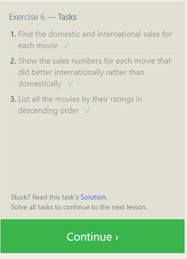
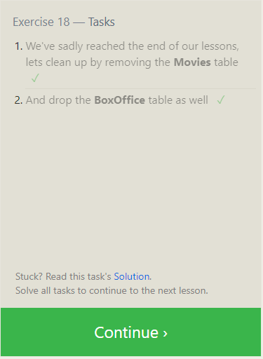

# Introduction to SQL

**I understand how relational databases work—they organize data neatly into tables. Normalization helps keep things efficient, reducing repetition. I use SQL to manage databases, with simple commands like SELECT and DELETE. Clauses like WHERE help me filter data easily. Constraints make sure everything is accurate, and transactions keep things reliable when I'm working with the database.**

